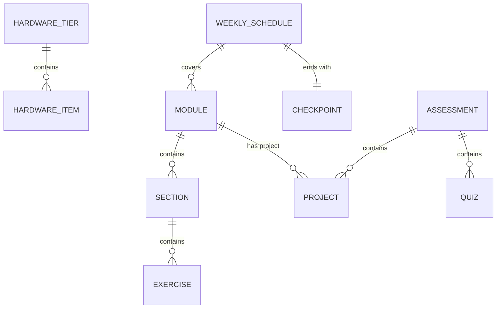

# Data Model: Complete Physical AI Book Content

**Date**: 2025-12-12
**Feature**: 003-complete-book-content

## Overview

This document defines the content entities and their relationships for the Physical AI book. Since this is a documentation project, the "data model" represents content structure rather than database schema.

---

## Content Entities

### 1. Module

A thematic unit of educational content covering a major topic area.

**Attributes**:
| Field | Type | Description |
|-------|------|-------------|
| id | string | Unique identifier (module-1, module-2, etc.) |
| title | string | Display name (e.g., "ROS 2 Fundamentals") |
| priority | enum | P1, P2, P3 (implementation priority) |
| description | string | Brief summary of module content |
| prerequisites | string[] | Required knowledge before starting |
| learning_outcomes | string[] | What students will learn |
| sections | Section[] | Child content sections |

**Instances**:
- module-1: ROS 2 Fundamentals (P1)
- module-2: Simulation Environments (P1)
- module-3: NVIDIA Isaac Platform (P2)
- module-4: VLA Systems (P2)
- hardware: Hardware Guide (P2)
- weekly-breakdown: 8-Week Schedule (P3)
- assessments: Projects & Quizzes (P2)

---

### 2. Section

A single markdown file within a module covering a specific topic.

**Attributes**:
| Field | Type | Description |
|-------|------|-------------|
| id | string | Filename without extension |
| title | string | Frontmatter title |
| sidebar_position | number | Order in navigation |
| description | string | SEO/preview description |
| parent_module | Module | Parent module reference |
| word_count | number | Minimum 500 words |
| has_code_examples | boolean | Contains runnable code |
| has_exercises | boolean | Contains hands-on exercises |

**Content Structure**:
Each section file MUST include:
1. YAML frontmatter (title, sidebar_position, description)
2. Overview paragraph
3. Prerequisites (if applicable)
4. Core content (concepts, explanations)
5. Code examples (with expected output)
6. Exercises (at least 1 per section)
7. Further reading (optional)

---

### 3. Exercise

A hands-on activity within a section.

**Attributes**:
| Field | Type | Description |
|-------|------|-------------|
| title | string | Exercise name |
| difficulty | enum | beginner, intermediate, advanced |
| estimated_time | string | e.g., "15 minutes" |
| objectives | string[] | Learning goals |
| steps | Step[] | Ordered instructions |
| expected_output | string | What success looks like |
| hints | string[] | Optional help |

**Minimum per Module**: 3 exercises

---

### 4. Project

A comprehensive assessment requiring integration of multiple concepts.

**Attributes**:
| Field | Type | Description |
|-------|------|-------------|
| id | string | Project identifier |
| title | string | Project name |
| module | Module | Associated module |
| description | string | Project overview |
| requirements | string[] | Functional requirements |
| deliverables | string[] | What to submit |
| rubric | RubricItem[] | Grading criteria |
| estimated_time | string | e.g., "4-6 hours" |

**Required Projects**:
1. Module 1 Project: Basic Robot Control System
2. Module 2 Project: Simulated Robot Navigation
3. Module 3 Project: Isaac Perception Pipeline
4. Module 4 Project: VLA Model Integration
5. Capstone Project: Full System Integration

---

### 5. HardwareTier

Classification of equipment by cost and capability.

**Attributes**:
| Field | Type | Description |
|-------|------|-------------|
| tier | enum | budget, recommended, premium |
| price_range | string | e.g., "<500 USD" |
| target_audience | string | Who this tier is for |
| capabilities | string[] | What this tier enables |
| items | HardwareItem[] | Specific recommendations |

---

### 6. HardwareItem

A specific piece of hardware with pricing.

**Attributes**:
| Field | Type | Description |
|-------|------|-------------|
| name | string | Product name |
| category | enum | compute, robot, sensor, actuator |
| tier | HardwareTier | Associated tier |
| price_usd | number | Current price |
| purchase_link | string | Where to buy |
| last_updated | date | Price verification date |
| notes | string | Usage notes |

---

### 7. WeeklySchedule

A two-week block of the 8-week curriculum.

**Attributes**:
| Field | Type | Description |
|-------|------|-------------|
| weeks | string | e.g., "Week 1-2" |
| focus_area | string | Primary topic |
| modules_covered | Module[] | Associated modules |
| daily_activities | DayActivity[] | Day-by-day breakdown |
| time_estimate_hours | number | Total hours |
| checkpoint | Checkpoint | End-of-period assessment |

---

### 8. Quiz

A knowledge check for a specific week.

**Attributes**:
| Field | Type | Description |
|-------|------|-------------|
| week | number | Week number (1-8) |
| topics | string[] | Topics covered |
| question_count | number | Number of questions |
| question_types | enum[] | multiple_choice, short_answer, code_review |
| passing_score | number | Minimum to pass (percentage) |

**Required**: 8 quizzes (one per week)

---

## Entity Relationships

---

## Validation Rules

### Section Validation
- [ ] Title is present in frontmatter
- [ ] sidebar_position is unique within module
- [ ] Word count >= 500
- [ ] At least 1 code example if technical topic
- [ ] Code examples include expected output
- [ ] All internal links resolve

### Module Validation
- [ ] Index.md exists with overview
- [ ] At least 3 exercises across sections
- [ ] Project file exists with rubric
- [ ] Prerequisites clearly stated

### Hardware Validation
- [ ] Price in USD with date
- [ ] At least 3 tiers represented
- [ ] Purchase links are valid
- [ ] Alternatives for each category

### Assessment Validation
- [ ] 4 module projects defined
- [ ] 1 capstone project defined
- [ ] 8 weekly quizzes outlined
- [ ] All rubrics have clear criteria
